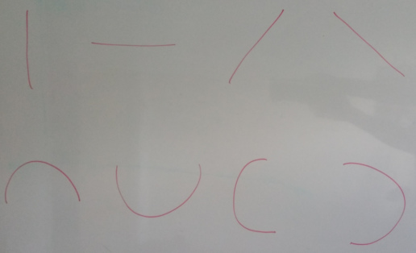
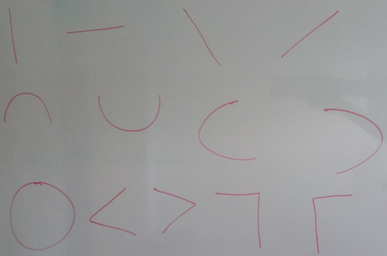

# deep-learning-mnist
Learn Deep Learning using MNIST dataset using PyTorch

# Features in 1st convolution layer

# Features in 2nd convolution layer

# References
https://pytorch.org/tutorials/beginner/nn_tutorial.html
